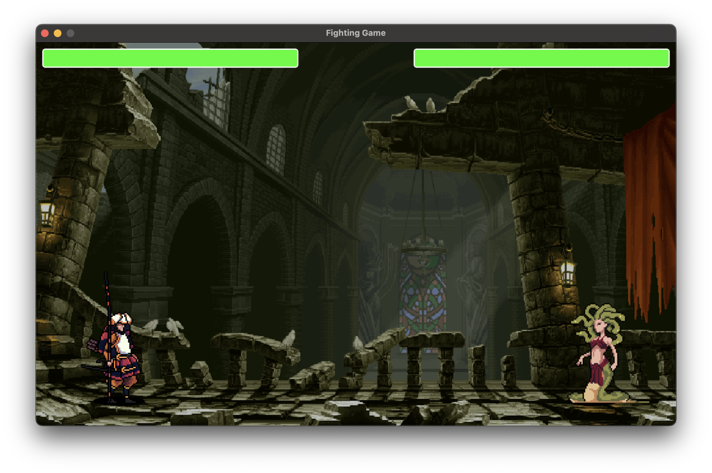

### 1. Prerequisites

- At least python3.12

### 2. Install dependencies

```bash
python3 -m venv venv

source venv/bin/active

pip3 -r install -r requirements.txt 
```

### 3. Run project

```
python3 main.py
```

### 3. Preview

