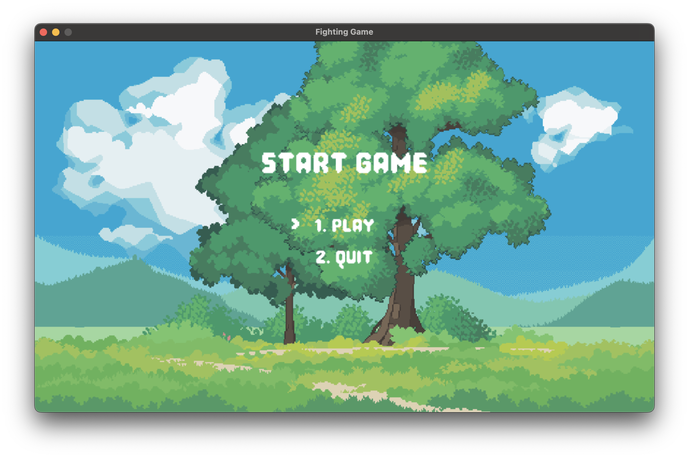
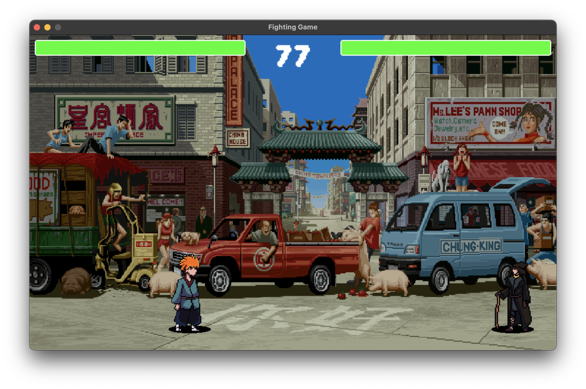
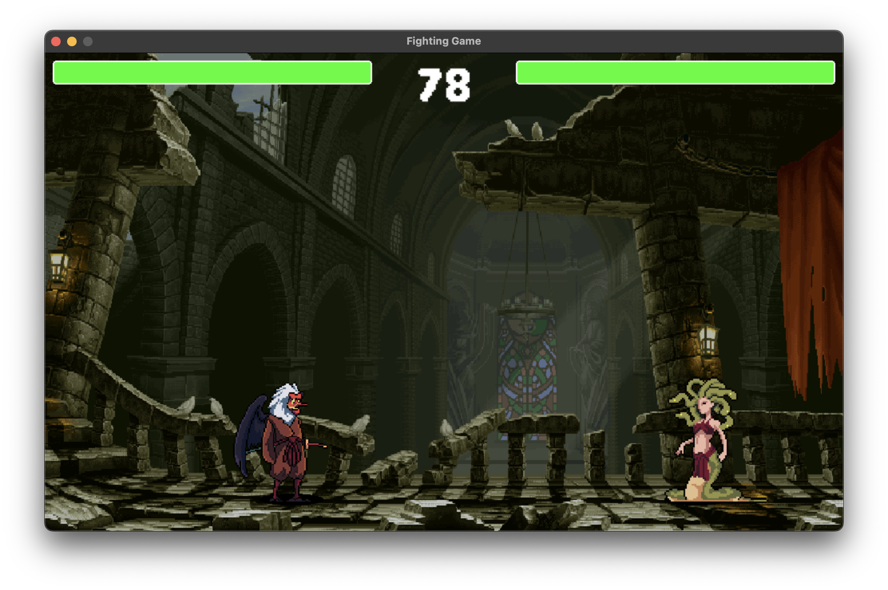
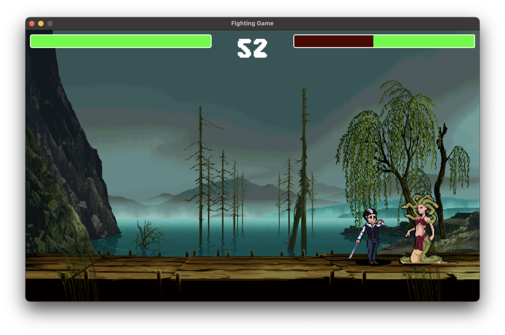

# Game Client

This is a simple GUI client for a multiplayer fighting game. You can connect, play, and battle with others in real time.
## Table of Contents

- [About](#about)
- [Setup](#setup)
- [How to Run](#how-to-run)
- [Preview](#preview)

## About

This project is a graphical client for a multiplayer fighting game. It lets you join battles, see what's happening in the game, and have fun fighting other players.

## Setup

### Prerequisites

- Make sure you have Python 3.12 or newer installed.

### Install Dependencies

Open your terminal and run:

```bash
python3 -m venv venv
source venv/bin/activate
pip3 install -r requirements.txt
```

## How to Run

Start the game with:

```bash
python3 main.py
```

## Preview

Here are some screenshots from the game:




