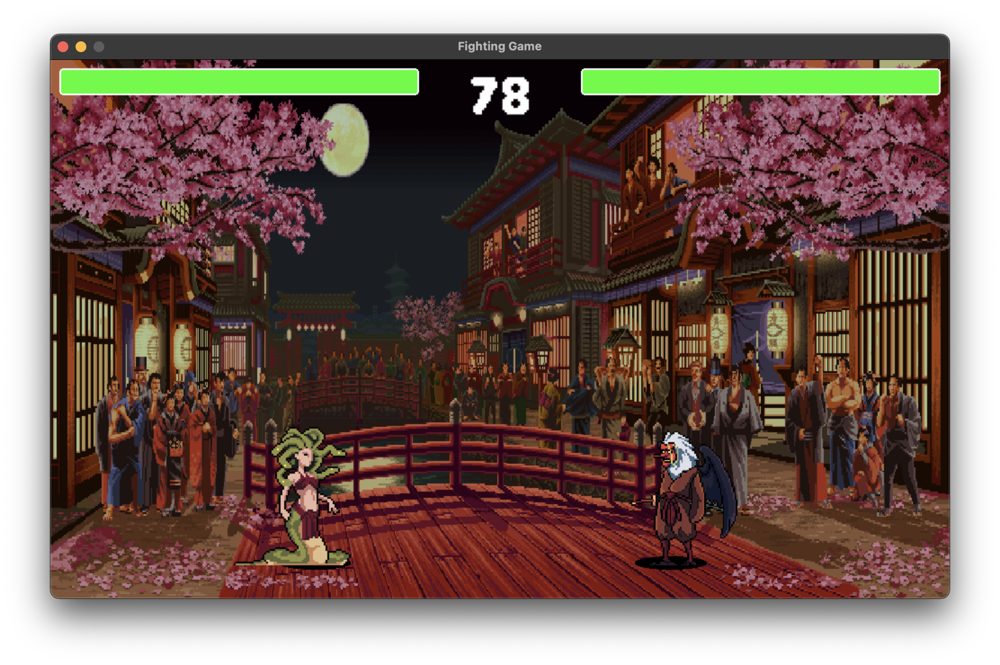
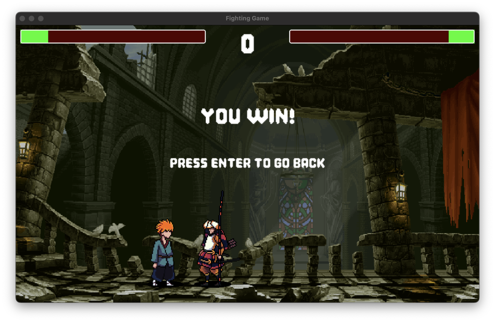

## How to setup this project

### 1. Prerequisites

- At least python3.12

### 2. Install dependencies

```bash
python3 -m venv venv

source venv/bin/activate

pip3 install -r requirements.txt 
```

### 3. Run project

```
python3 main.py
```


## Preview

### 1. Gameplay



